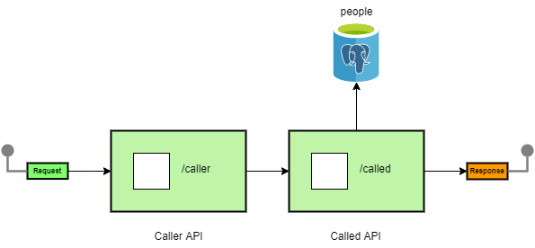

# [Docker Compose](https://docs.docker.com/compose)

[](https://www.oracle.com/java/technologies/javase/jdk14-archive-downloads.html)
[](https://mvnrepository.com/artifact/org.springframework.boot/spring-boot-starter-parent/2.3.5.RELEASE)
[](http://maven.apache.org/download.cgi)
[](https://mvnrepository.com/artifact/org.postgresql/postgresql/42.2.18)
[](https://docs.docker.com/compose/compose-file)

## Content

- [Introduction](#introduction)
- [Getting Started](#getting-started)
- [Create the data source](#create-the-data-source)
- [Author](#author)

### Introduction <a name="introduction"></a>

The purpose of this project is to show how an entire environment can be ran using one single Docker Compose command.
Below is the project's structure.

Four docker containers will be created from this 'docker-compose.yml' file, and are listed below.

- Caller Spring Boot API that calls the Called Spring Boot API.
- Called Spring Boot API that is being called by the Caller Spring Boot API and persists the data in the PostgreSQL DB.
- PostgreSQL DB that holds the records.
- Pgadmin GUI for the PostgreSQL DB.



### Getting Started <a name="getting-started"></a>

In order to run this project, the following commands need to be executed in the given order.

- Build the project.

```
    mvn clean install
```

- Start all the docker containers.

```
    docker-compose up -d
```

- Stop all the docker containers

```
    docker-compose down
```

### Create the data source <a name="create-the-data-source"></a>

- Navigate to 'View' - 'Tool Windows' - 'Database'.
- Create a new PostgreSQL DB data source, with the following values.
    - Name: postgresql_datasource
    - Host: localhost
    - Port: 5432
    - User: postgresql
    - Password: postgresql
    - Database: postgresql_db
    - URL: jdbc:postgresql://localhost:5432/postgresql_db

### Author <a name="author"></a>

[Viktor Talevski](https://www.linkedin.com/in/viktor-talevski-a7366794)
